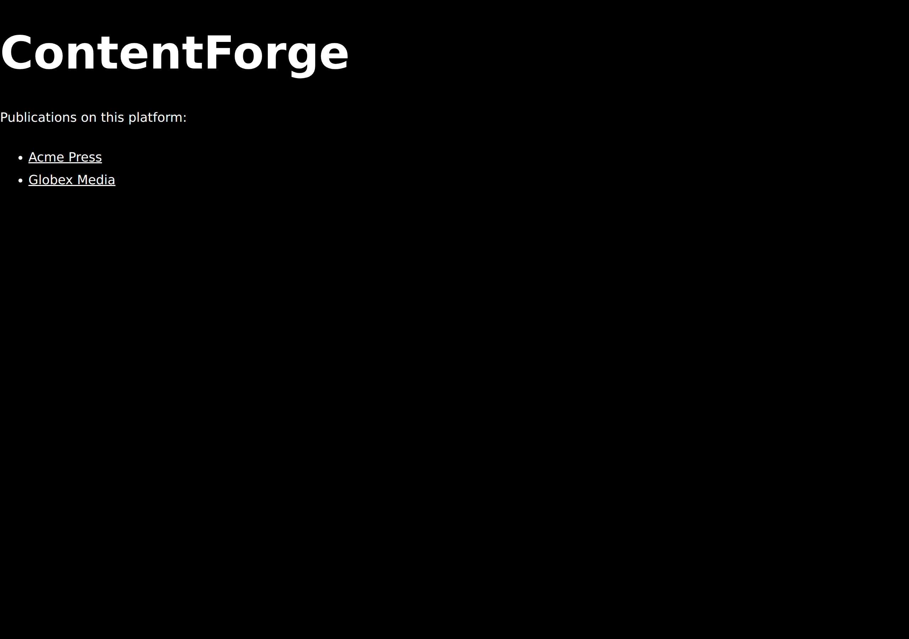
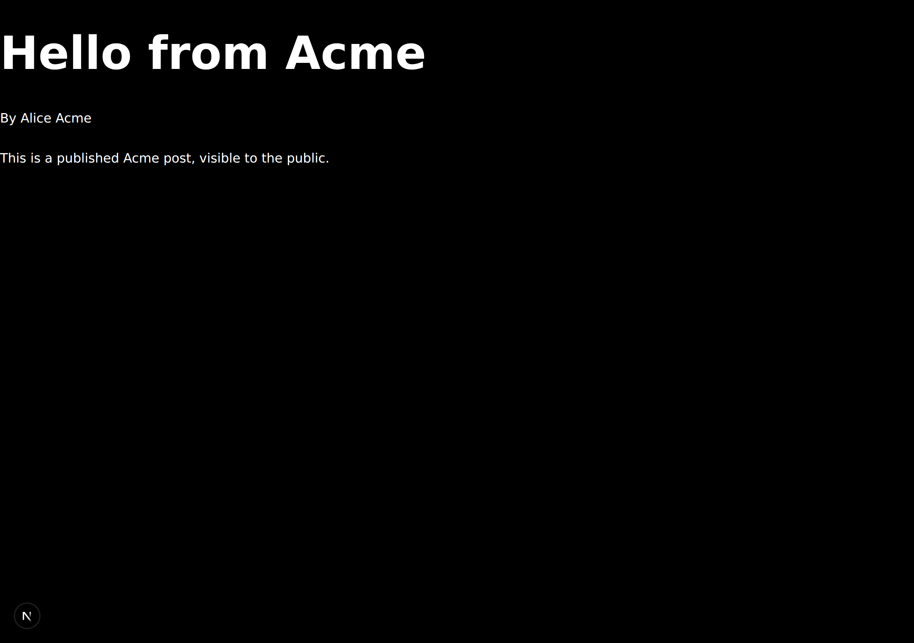
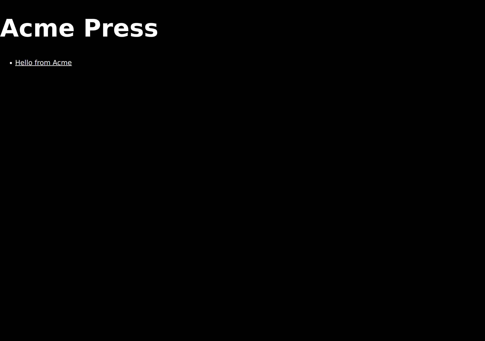
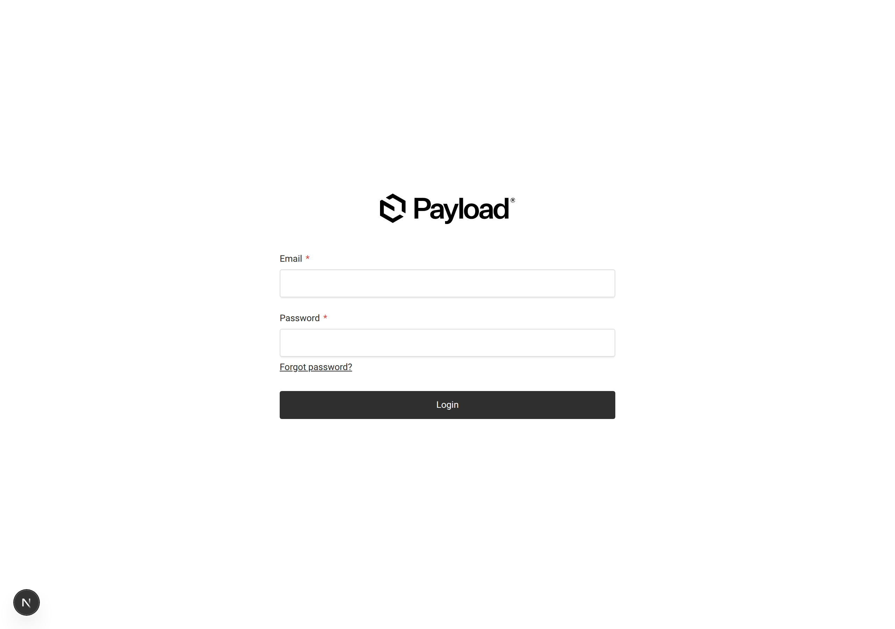

# ContentForge

Multi-tenant headless CMS and publication platform. Editors manage posts, authors, and media scoped to their own tenant; readers get a public Next.js frontend per tenant with tag-based on-demand revalidation.

## Stack

| Layer | Tech |
| ----- | ---- |
| CMS | [Payload 3](https://payloadcms.com) (self-hosted, Lexical rich text) |
| Frontend | Next.js 15 App Router, React 19, Tailwind CSS v4 |
| Database | PostgreSQL 16 (Payload Drizzle adapter) |
| Media storage | S3-compatible (MinIO in dev) |
| Tests | Vitest — unit tier + integration tier against a real Payload instance |

## Quick start

Requires Node ≥ 20.9, pnpm, and Docker.

```bash
docker compose up -d        # Postgres on :5434, MinIO on :9002 (console :9003)
cp .env.example .env        # dev defaults match docker-compose
pnpm install
pnpm db:migrate
pnpm db:seed                # demo tenants (acme, globex), users, posts — dev only
pnpm dev                    # http://localhost:3000
```

Then:

- Public site: <http://localhost:3000/acme> and <http://localhost:3000/globex>
- Admin panel: <http://localhost:3000/admin> — `admin@contentforge.dev` / `admin123` (dev seed credentials; override with `SEED_ADMIN_PASSWORD` / `SEED_EDITOR_PASSWORD`)

Ports are offset (5434, 9002/9003) so the stack coexists with default local Postgres/MinIO installs.

## Screenshots

| Public homepage | Post detail |
| --- | --- |
|  |  |
| The root route lists every publication, fetched with `unstable_cache` tagged `tenants`. | A published post served per-tenant at `/[tenant]/posts/[slug]`. |

| Tenant homepage | Admin panel |
| --- | --- |
|  |  |
| A single tenant's homepage with its published posts. | The self-hosted Payload admin at `/admin`. |

## Tenant isolation — the invariant that matters

Every content collection (posts, authors, media) belongs to exactly one tenant, and editors must never read or write outside their own tenant.

- **Reads** are scoped by the `tenantFromUser` access function (a `Where` clause per request).
- **Writes** are enforced by the `enforceTenantOnWrite` hook, because access `Where` clauses are inert on `create` — the hook forces the editor's own tenant on create and update.

Both live in [src/lib/access.ts](src/lib/access.ts). Every tenant-scoped collection must wire the hook in `hooks.beforeValidate`; `tests/unit/collections-wiring.spec.ts` enforces this and `tests/int/tenant-isolation.int.spec.ts` proves it end-to-end against a real database.

## Testing

```bash
pnpm test:unit       # fast, no DB
pnpm test:int        # needs docker compose up; uses a dedicated contentforge_test DB
pnpm test            # both
pnpm test:coverage   # V8 coverage report
```

CI (GitHub Actions) runs types-drift check, typecheck, strict lint, both test tiers, and a production build on every push and PR.

## Deployment (Vercel + Neon + AWS S3)

Production runs on Vercel with Neon Postgres and a **private** AWS S3 bucket (media is
streamed through Payload's `/api/media/file/*` route with tenant access control — no
public bucket policy).

- `vercel.json` sets the build to `pnpm run db:migrate && pnpm run build`: migrations
  run against the production `DATABASE_URI` before every build, then the build fails
  fast if the schema and code disagree.
- Required env vars in Vercel: `DATABASE_URI` (Neon **pooled** string with
  `?sslmode=require`), `PAYLOAD_SECRET`, `REVALIDATE_SECRET`, `S3_REGION`, `S3_BUCKET`,
  `S3_ACCESS_KEY`, `S3_SECRET_KEY`, and after the first deploy `NEXT_REVALIDATE_URL` +
  `NEXT_PUBLIC_SERVER_URL` (the production URL, no trailing slash). Leave `S3_ENDPOINT`
  unset — it is MinIO-only.
- **Schema-change workflow (load-bearing):** push mode never runs in production, so a
  collection change deployed without a committed migration silently never reaches the
  prod schema. After any collection change:

  ```bash
  pnpm generate:types
  pnpm payload migrate:create <name>
  git add src/migrations payload-types.ts && git commit
  ```

  The Vercel build then applies the migration on the next deploy.
- If a migration ever fails mid-apply, inspect with `pnpm payload migrate:status`
  pointed at Neon's **direct** (non-pooled) connection string and fix forward with a
  new migration.

## Development notes

- After any collection schema change: `pnpm generate:types` (CI fails on stale types), then `pnpm payload migrate:create` for the schema migration.
- Env vars are validated at startup — missing `PAYLOAD_SECRET` or `DATABASE_URI` fails fast. Generate real secrets with `openssl rand -hex 32`.
- Agent-facing conventions live in [CLAUDE.md](CLAUDE.md) and per-module specs under `src/*/CLAUDE.md`.
